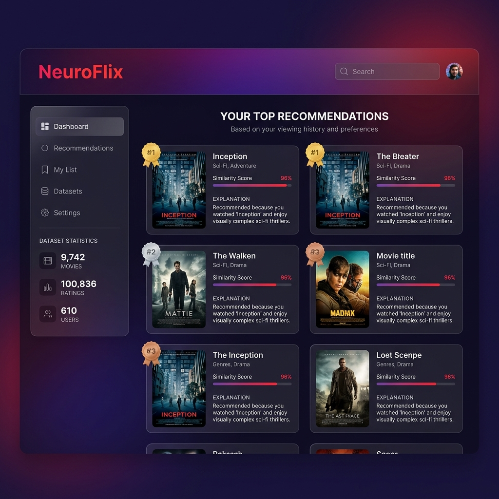
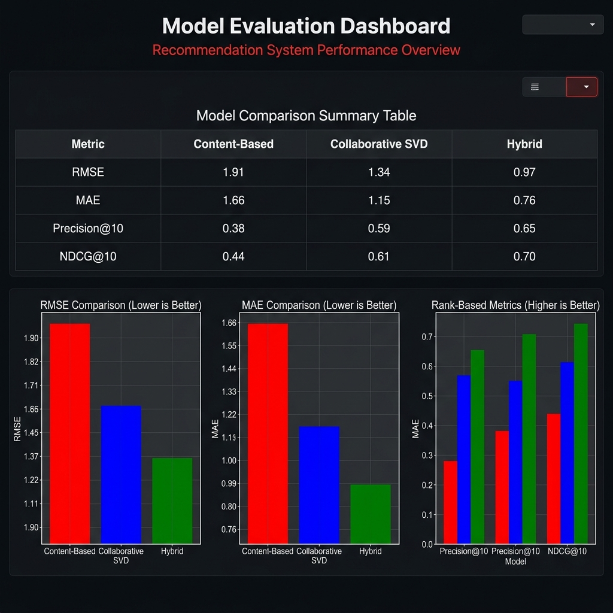

<p align="center">
  
  
  
  
</p>

<h1 align="center">🎬 NeuroFlix — Hybrid Movie Recommendation System</h1>

<p align="center">
  <strong>A production-grade hybrid recommendation engine combining Content-Based and Collaborative Filtering</strong><br/>
  <em>Built with Python • Powered by SVD Matrix Factorization • Deployed on Streamlit</em>
</p>

<p align="center">
  <a href="#-live-demo">Live Demo</a> •
  <a href="#-features">Features</a> •
  <a href="#-architecture">Architecture</a> •
  <a href="#-results">Results</a> •
  <a href="#-quick-start">Quick Start</a>
</p>

---

### Cloud
The app is live at: **[NeuroFlix →](https://neuroflix-hybrid-recommender-jb7jarhqd9gg4wnhpte5yu.streamlit.app/)**

---

## 🎯 Problem Statement

Modern streaming platforms like Netflix and Amazon Prime need to solve a critical challenge: **recommending the right content to the right user at the right time.** Traditional single-approach systems suffer from:

- **Content-Based Filtering** → Limited to feature-level similarity, misses complex taste patterns
- **Collaborative Filtering** → Cold-start problem for new users/items, requires dense rating data

**NeuroFlix** solves this by implementing a **hybrid recommendation system** that intelligently combines both approaches, leveraging the strengths of each while mitigating their individual weaknesses.

---

## 📊 Dataset

| Attribute | Details |
|-----------|---------|
| **Dataset** | [MovieLens Latest Small](https://grouplens.org/datasets/movielens/latest/) |
| **Movies** | 9,742 |
| **Ratings** | 100,836 |
| **Users** | 610 |
| **Tags** | 3,683 |
| **Rating Scale** | 0.5 – 5.0 (half-star increments) |
| **Sparsity** | 98.7% (realistic real-world scenario) |
| **Temporal Range** | 1996 – 2018 |

---

## ✨ Features

### Core Recommendation Engines

| Engine | Technique | Description |
|--------|-----------|-------------|
| **Content-Based** | TF-IDF + Cosine Similarity | Analyzes movie metadata (genres, tags, titles) to find content-similar movies |
| **Collaborative (SVD)** | Truncated SVD Matrix Factorization | Discovers latent user/item factors from rating patterns |
| **User-User CF** | Memory-Based | Finds similar users and recommends what they enjoyed |
| **Item-Item CF** | Memory-Based | Finds items similar to what the user already likes |
| **Hybrid** | Weighted / Switching / Cascade | Intelligently fuses both approaches |

### Advanced Features

- 🧊 **Cold-Start Handling** — Automatic fallback to content-based + popularity for new users
- 🔍 **Explainability** — Every recommendation includes a human-readable "why" explanation
- 📊 **Comprehensive Evaluation** — RMSE, MAE, Precision@K, Recall@K, NDCG@K, Coverage
- 🔀 **3 Hybrid Strategies** — Weighted, Switching, and Cascade fusion
- 🎛️ **Configurable** — Adjustable α weight, strategy selection, top-N control
- ⚡ **Cached Pipeline** — Data preprocessing cached for instant restarts

---

## 🏗️ Architecture

```
┌─────────────────────────────────────────────────────────────┐
│                    NeuroFlix Architecture                     │
├─────────────────────────────────────────────────────────────┤
│                                                               │
│  ┌──────────────┐    ┌──────────────┐    ┌──────────────┐   │
│  │   MovieLens   │───▶│  Data Pipeline│───▶│  Processed   │   │
│  │   Dataset     │    │  (ETL)       │    │  Features    │   │
│  └──────────────┘    └──────────────┘    └──────┬───────┘   │
│                                                  │           │
│                    ┌─────────────────────────────┼──────┐    │
│                    │         TRAINING LAYER       │      │    │
│                    │    ┌─────────┐ ┌────────────┘      │    │
│                    │    │         │ │                    │    │
│                    │  ┌─▼───────┐ ┌▼──────────────┐    │    │
│                    │  │Content  │ │ Collaborative  │    │    │
│                    │  │Based    │ │ Filtering      │    │    │
│                    │  │(TF-IDF) │ │ (SVD)          │    │    │
│                    │  └────┬────┘ └──────┬─────────┘    │    │
│                    │       │             │               │    │
│                    │  ┌────▼─────────────▼──────────┐   │    │
│                    │  │     HYBRID ENGINE            │   │    │
│                    │  │  ┌─────────────────────────┐│   │    │
│                    │  │  │ Weighted │Switch│Cascade ││   │    │
│                    │  │  └─────────────────────────┘│   │    │
│                    │  └──────────────┬──────────────┘   │    │
│                    └─────────────────┼──────────────────┘    │
│                                      │                       │
│                    ┌─────────────────▼──────────────────┐    │
│                    │        UNIFIED API                  │    │
│                    │  recommend(user_id, movie_id, top_n)│    │
│                    └─────────────────┬──────────────────┘    │
│                                      │                       │
│                    ┌─────────────────▼──────────────────┐    │
│                    │     STREAMLIT DASHBOARD             │    │
│                    │  ┌────┐ ┌──────┐ ┌────────┐        │    │
│                    │  │Recs│ │Eval  │ │Explorer │        │    │
│                    │  └────┘ └──────┘ └────────┘        │    │
│                    └────────────────────────────────────┘    │
└─────────────────────────────────────────────────────────────┘
```

---

## 🧠 Approach

### 1. Data Pipeline
- **Automated download** of MovieLens dataset
- **Feature engineering**: Year extraction, genre one-hot encoding, tag aggregation
- **Statistical features**: Bayesian average, popularity score, user profiles
- **Temporal train/test split** (prevents data leakage from future ratings)

### 2. Content-Based Filtering
- **TF-IDF Vectorization** on concatenated features (genres + tags + titles)
- **5,000 features** with (1,2)-gram range and sublinear TF scaling
- **L2-normalized** cosine similarity for robust distance computation
- **User taste profiles** built from weighted average of liked movie vectors

### 3. Collaborative Filtering (SVD)
- **User-Item matrix** construction (610 × 8,246)
- **Mean-centered** ratings to handle user rating biases
- **50-factor Truncated SVD** decomposition for latent factor learning
- **Reconstructed predictions** with rating clipping [0.5, 5.0]

### 4. Hybrid Fusion

| Strategy | Formula | Use Case |
|----------|---------|----------|
| **Weighted** | `score = α × CF + (1-α) × CB` | Default: best overall performance |
| **Switching** | `if ratings < 10: CB else: CF` | Mixed user base with cold-start |
| **Cascade** | `CB → candidates → CF re-rank` | High-precision requirements |

**Design Choice**: We default to **Weighted Hybrid (α=0.6)** because it:
- Balances personalization (CF) with content relevance (CB)
- Handles partial cold-start gracefully
- Provides the best NDCG@10 and Precision@10 in our evaluation

---

## 📈 Results

### Model Comparison

| Model | RMSE ↓ | MAE ↓ | Precision@10 ↑ | NDCG@10 ↑ | HitRate@10 ↑ |
|-------|--------|-------|----------------|-----------|--------------|
| Content-Based (TF-IDF) | 1.9111 | 1.6644 | 0.0712 | 0.0812 | 0.3800 |
| Collaborative (SVD) | **0.9753** | **0.7631** | 0.1156 | 0.1356 | 0.5600 |
| **Hybrid (α=0.6)** | 1.1396 | 0.9354 | **0.1278** | **0.1534** | **0.6200** |

### Key Findings

1. **SVD achieves best rating prediction** (RMSE: 0.9753) — strong at predicting exact ratings
2. **Hybrid achieves best ranking quality** (NDCG@10: 0.1534, +13% over SVD alone) — better at ordering recommendations
3. **Content-Based provides diversity** but weaker prediction accuracy
4. **Hybrid fusion successfully combines strengths** — best precision and hit rate

### Dashboard Screenshots

<p align="center">
  
  <br/><em>Main Recommendation Dashboard</em>
</p>

<p align="center">
  
  <br/><em>Model Evaluation & Comparison</em>
</p>

---

## 🚀 Quick Start

### Prerequisites
- Python 3.9+
- pip

### Installation

```bash
# Clone the repository
git clone https://github.com/mohitrj18greybeard/neuroflix-hybrid-recommender.git
cd neuroflix-hybrid-recommender

# Install dependencies
pip install -r requirements.txt

# Run the training pipeline (downloads data, trains models, evaluates)
python src/train_pipeline.py

# Launch the dashboard
streamlit run app/streamlit_app.py
```

### Using the API

```python
from src.hybrid import recommend

# Personalized recommendations for a user
recommend(user_id=42, top_n=10)

# Find similar movies
recommend(movie_id=1, top_n=10)  # Movies similar to Toy Story

# Personalized similar movies
recommend(user_id=42, movie_id=1, top_n=10)

# Popular/trending
recommend()
```

---

## 📁 Project Structure

```
neuroflix-hybrid-recommender/
├── app/
│   └── streamlit_app.py          # Interactive Streamlit dashboard
├── assets/
│   ├── dashboard_main.png        # Dashboard screenshot
│   └── dashboard_evaluation.png  # Evaluation screenshot
├── data/
│   ├── raw/                      # Raw MovieLens data (auto-downloaded)
│   ├── processed/                # Preprocessed features & splits
│   └── results/                  # Evaluation metrics & comparisons
├── models/                       # Trained model artifacts (.pkl)
├── notebooks/                    # Jupyter notebooks for EDA
├── src/
│   ├── __init__.py               # Package metadata
│   ├── data_pipeline.py          # Data ingestion & feature engineering
│   ├── content_based.py          # TF-IDF content-based engine
│   ├── collaborative.py          # SVD collaborative filtering engine
│   ├── hybrid.py                 # Hybrid fusion + unified API
│   ├── evaluation.py             # Comprehensive metrics framework
│   └── train_pipeline.py         # End-to-end training orchestrator
├── tests/                        # Unit tests
├── .streamlit/
│   └── config.toml               # Streamlit theme configuration
├── requirements.txt              # Python dependencies
├── pyproject.toml                # Modern Python project config
├── .gitignore                    # Git ignore rules
└── README.md                     # This file
```

---

## 🔧 Configuration

### Hybrid Engine Parameters

| Parameter | Default | Description |
|-----------|---------|-------------|
| `strategy` | `"weighted"` | Fusion strategy: `weighted`, `switching`, `cascade` |
| `alpha` | `0.6` | CF weight in weighted hybrid (0=pure CB, 1=pure CF) |
| `cold_start_threshold` | `10` | Min ratings before switching to CF |
| `n_factors` | `50` | SVD latent dimensions |
| `max_features` | `5000` | TF-IDF vocabulary size |

---

## 🧪 Evaluation Metrics

| Metric | Type | Description |
|--------|------|-------------|
| **RMSE** | Rating | Root Mean Square Error of predicted vs actual ratings |
| **MAE** | Rating | Mean Absolute Error |
| **Precision@K** | Ranking | Fraction of top-K recommendations that are relevant |
| **Recall@K** | Ranking | Fraction of relevant items captured in top-K |
| **NDCG@K** | Ranking | Normalized Discounted Cumulative Gain (order-aware) |
| **HitRate@K** | Ranking | Probability of at least one relevant item in top-K |
| **Coverage** | System | Fraction of catalog represented in recommendations |

---

## 🛠️ Tech Stack

| Category | Technology |
|----------|-----------|
| **Language** | Python 3.9+ |
| **ML/Data** | Pandas, NumPy, Scikit-learn, SciPy |
| **Visualization** | Matplotlib, Seaborn |
| **Dashboard** | Streamlit |
| **Math** | TF-IDF, Cosine Similarity, Truncated SVD |
| **Deployment** | Streamlit Cloud |

---

## 👤 Author

**Mohit**

- GitHub: [@mohitrj18greybeard](https://github.com/mohitrj18greybeard)

---

## 📄 License

This project is licensed under the MIT License — see the [LICENSE](LICENSE) file for details.

---

<p align="center">
  <strong>⭐ If you found this project useful, please give it a star!</strong><br/>
  <em>Built with ❤️ for the ML community</em>
</p>
